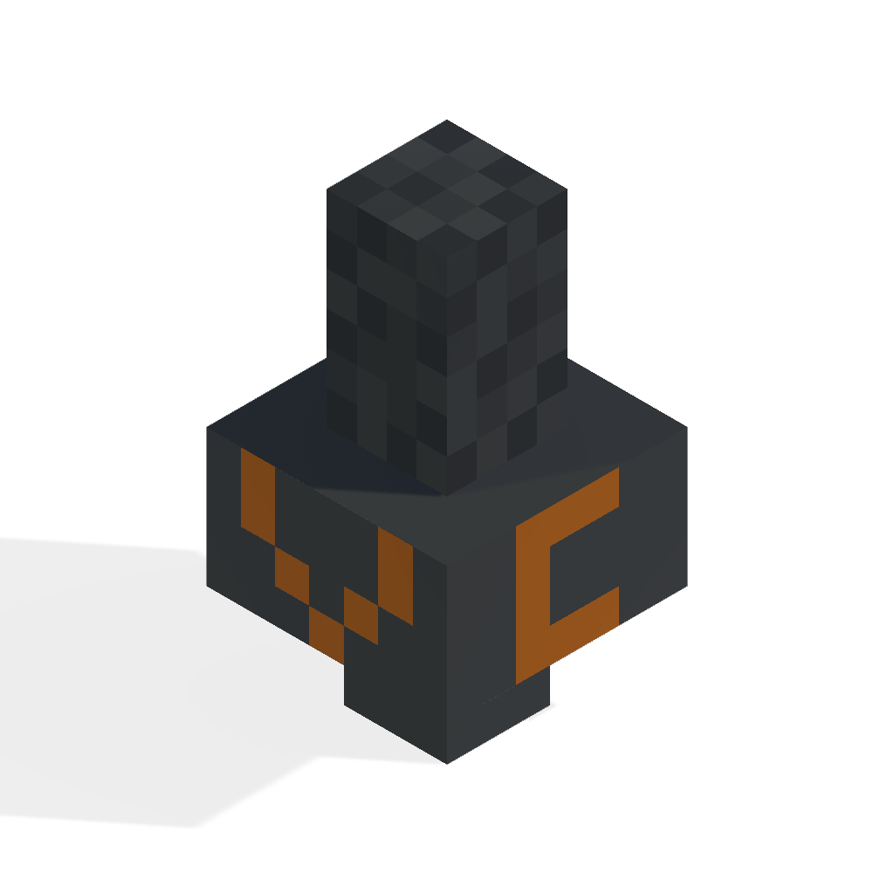

# VoiceCraft Proximity Chat

Proximity voice chat for Minecraft Bedrock Edition supporting Windows and Android.

  

> [!WARNING]
> VOICECRAFT DOES NOT REQUIRE THE USE OF ANY THIRD PARTY SERVICE! VOICECRAFT IS ALSO NOT A MOD, PLUGIN OR STANDALONE ADDON/WORLD!

> [!NOTE]
> THIS VERSION DOES NOT REQUIRE THE USE OF DISCORD OR ANY THIRD PARTY VC SOFTWARE. EVERYTHING IS BUILT-IN AND WORKS WITH THE VANILLA BDS SOFTWARE.

> [!WARNING]
> For Windows users. since it has been more than 6 months since v1.0.7 released, the certificate expired meaning that to install the application properly, you will need to turn back the time on your device. We are working hard on v1.1.0 to resolve this issue. If you wish to help speedup the development then please join the discord to talk to me directly for guidance.

## Project Description
VoiceCraft proximity chat is a VOIP program developed on .NET 8.0 MAUI framework and .NET 8.0 Console, started by SineVector241, this project enables Voice Proximity chat for the game Minecraft on the bedrock platform which gives a more immersive, communicative experience. This project will also expand into supporting more platforms such as IOS and MAC devices. This project only allows for a self-hosted framework giving the owners more control on how they want it to be setup however the project may also expand into allowing multiple server instances on a single server that does not require a self-hosted framework and allows other users to host for other Minecraft server owners.

## Packages & Resources
- ### [Latest Release](https://github.com/AvionBlock/VoiceCraft/releases/latest)
- ### [Addon](https://github.com/AvionBlock/VoiceCraft-Addon)
- ### [Geyser Plugin](https://github.com/AvionBlock/GeyserVoice)
- ### [PocketMine Plugin](https://github.com/AvionBlock/VoiceCraft-PocketMine)
- ### [Docker Package](https://github.com/AvionBlock/VoiceCraft-Docker/pkgs/container/voicecraft)
- ### [Docker Page](https://hub.docker.com/r/sinevector241/voicecraft/tags)

## Installation Guide
Please refer to the [wiki](https://github.com/SineVector241/VoiceCraft-MCBE_Proximity_Chat/wiki) for installations.

## Supported Devices

- ✅ Fully and natively supported.
- ❎ Can be supported but no reason to.
- ❗ Unknown status (limited support)
- ❌ Not supported.

| Device      | x64 | x86 | arm32 | arm64 | Audio Backend |
|-------------|--|--|----|--|---------------|
| Linux       | ❌ | ❌ | ❌   | ❌ | N.A.          |
| Android     | ❌ | ❌ | ✅  | ✅ | Android API   |
| Windows     | ✅ | ❌ | ❌  | ❌ | WinMM         |
| iOS         | ❌ | ❌ | ❌   | ❌ | N.A.          |
| MacOS       | ❌ | ❌ | ❌  | ❌ | N.A.          |
| Web         | ❌ | ❌ | ❌   | ❌ | N.A.          |
| XBOX        | ❌ | ❌ | ❌  | ❌ | N.A.          |
| PlayStation | ❌ | ❌ | ❌  | ❌ | N.A.          |
| Switch      | ❌ | ❌ | ❌  | ❌ | N.A.          |

## Hosts

- Atrioxhosting €0.44/m: https://atrioxhost.com/voicecraft

## Discord Server

