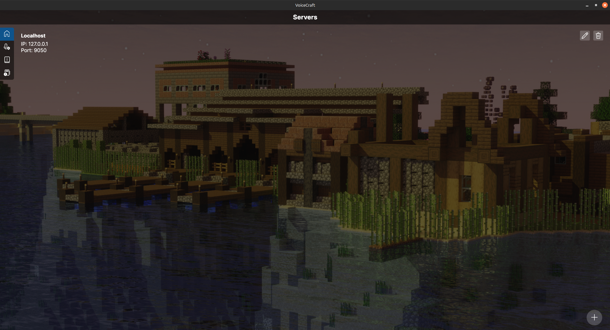

# VoiceCraft Proximity Chat

Proximity voice chat software for Minecraft Bedrock Edition supporting Windows, Android, iOS, Linux and MacOS.

  

> [!WARNING]
> VOICECRAFT DOES NOT REQUIRE THE USE OF ANY THIRD PARTY SERVICE! VOICECRAFT IS ALSO NOT A MOD, PLUGIN OR STANDALONE
> ADDON/WORLD! It is a collection of both addons, servers and client software working together in order to simulate
> proximity chat.

> [!NOTE]
> VoiceCraft is also not a standard voice chat that comes with groups or channels. It is designed to be customized
> through the api allowing recreation of channels, proximity, effects and more through the session based Addon API. This
> is essentially up to the server owner to install or add-on developer to implement.

## Project Description

VoiceCraft is a cross-platform proximity voice chat solution for minecraft bedrock edition. VoiceCraft supports a wide
range of devices to increase its availability to players and can indirectly support any other devices such as consoles
through the standard binding system.

VoiceCraft is developed in C# for both the server and client application which uses the avalonia framework and uses an
addon developed in JavaScript to establish a connection to the vanilla minecraft server.
VoiceCraft also uses the opus codec for audio data compression and SpeexDSP for voice enhancements with optional support
for hardware related preprocessors on android devices.

There is also a comprehensive API system in place that addon developer's can use to customize VoiceCraft's behavior,
audio effects, audio simulations, authentication, and more!

  

## Packages, Guides And Resources
- ### [Wiki](https://avionblock.github.io/VoiceCraft/)
- ### [Latest Release](https://github.com/AvionBlock/VoiceCraft/releases/latest)
- ### [Addon](https://github.com/AvionBlock/VoiceCraft-Addon)
- ### [Geyser Plugin](https://github.com/AvionBlock/GeyserVoice)
- ### [PocketMine Plugin](https://github.com/AvionBlock/VoiceCraft-PocketMine)
- ### [Docker Package](https://github.com/AvionBlock/VoiceCraft-Docker/pkgs/container/voicecraft)
- ### [Docker Page](https://hub.docker.com/r/sinevector241/voicecraft/tags)

## Supported Devices

- ✅ Fully and natively supported.
- ❎ Can be supported but no reason to.
- ❗ Unknown status (limited support)
- ❌ Not planned, Not supported.

| Device      | x64 | x86 | arm32 | arm64 | Audio Backend |
|-------------|-----|-----|-------|-------|---------------|
| Linux       | ✅   | ❌   | ✅     | ✅     | OpenAL        |
| Android     | ❎   | ❎   | ✅     | ✅     | Android API   |
| Windows     | ✅   | ✅   | ❌     | ✅     | WinMM         |
| iOS         | ❌   | ❌   | ✅     | ✅     | N.A.          |
| MacOS       | ✅   | ❌   | ❌     | ✅     | N.A.          |
| Web         | ❗   | ❗   | ❗     | ❗     | Web API       |
| XBOX        | ❌   | ❌   | ❌     | ❌     | N.A.          |
| PlayStation | ❌   | ❌   | ❌     | ❌     | N.A.          |
| Switch      | ❌   | ❌   | ❌     | ❌     | N.A.          |

## Hosts

- Atrioxhosting €0.44/m: https://atrioxhost.com/voicecraft

## Project Dependencies

> [!NOTE]
> All dotnet and microsoft extension packages aren't listed. If you wish to view all dependencies, You can look at the [Directory.Packages.props](./Directory.Packages.props) file.

### All Projects

- [Avalonia](https://github.com/AvaloniaUI/Avalonia)
- [LiteNetLib](https://github.com/RevenantX/LiteNetLib)
- [Jeek.Avalonia.Localization](https://github.com/tifish/Jeek.Avalonia.Localization)

### Client

- [SpeexDSPSharp](https://github.com/AvionBlock/SpeexDSPSharp)
- [OpusSharp](https://github.com/AvionBlock/OpusSharp)
- [Notification.Avalonia](https://github.com/AvaloniaCommunity/Notification.Avalonia)
- [NAudio](https://github.com/naudio/NAudio)
- [NWaves](https://github.com/ar1st0crat/NWaves)
- [OpenTK (OpenAL)](https://github.com/opentk/opentk)
- [discord-rpc-csharp](https://github.com/Lachee/discord-rpc-csharp)

### Server

- [WatsonWebsocket](https://github.com/jchristn/WatsonWebsocket)
- [Watson.Lite](https://github.com/dotnet/WatsonWebserver)
- [Spectre.Console](https://github.com/spectreconsole/spectre.console)
