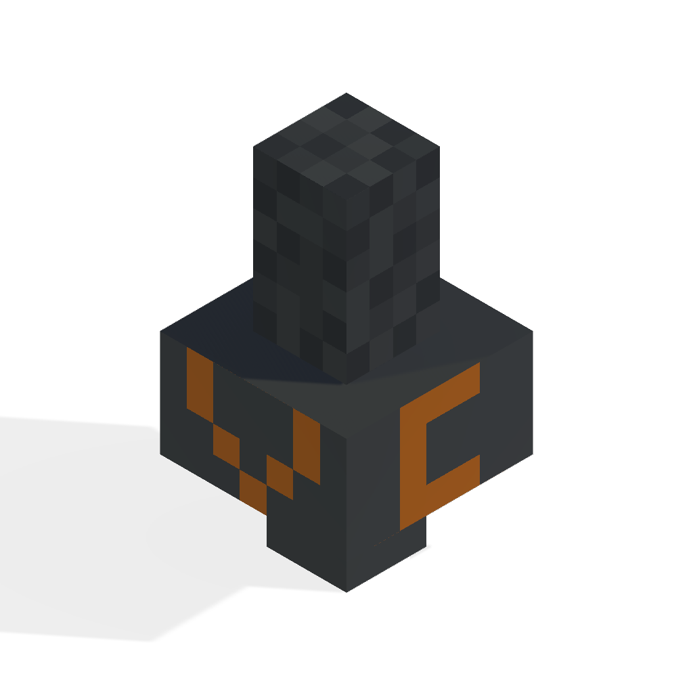
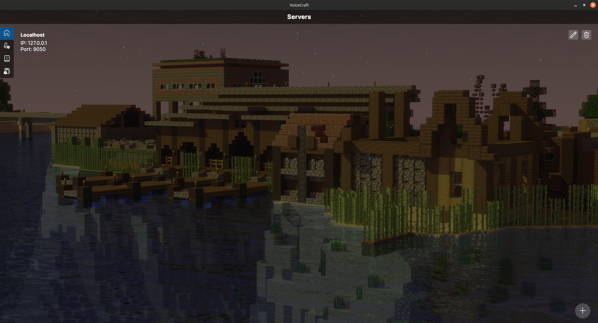

# VoiceCraft Proximity Chat

Cross-platform proximity voice chat for Minecraft servers and integrations, with client apps, a standalone voice server,
Minecraft-side bridges, and an API for custom behavior.

  

> [!WARNING]
> VoiceCraft does not require any third-party service. The hosted dashboard at https://voicecraft.chat is optional.
> VoiceCraft is also not a single mod, plugin, or standalone addon world. It is a set of clients, server software,
> addons, plugins, and protocol integrations working together to simulate proximity chat.

> [!NOTE]
> VoiceCraft is not a channel-based voice chat by default. It is built around session state, positioning, effects,
> visibility, and bitmask-based routing that integrations can control through the Addon API and McApi transports.

## Project Description

VoiceCraft is a proximity voice platform for Minecraft-focused deployments. It started around Minecraft Bedrock Edition,
but the core runtime is not limited to Bedrock-only setups: it can be connected to Bedrock worlds through addons, to
Java/Geyser environments through VoiceCraft.Java, and to custom integrations through the exposed API transports.

Players run a VoiceCraft client, the server owner runs or hosts a VoiceCraft server, and a Minecraft-side integration
sends player position, world, visibility, mute/deafen, and audio-effect state into the voice layer. VoiceCraft then routes
voice only to the entities that should hear it.

VoiceCraft is developed in C# for the server and client applications. The client UI is built with Avalonia, audio uses
Opus for compression and SpeexDSP/SoundFlow for processing and device I/O, and the network layer provides both the
VoiceCraft client protocol and Minecraft-facing transports such as McHttp, McWss, and McTcp.

  

## Resources

| Resource | Link | Description |
|----------|------|-------------|
| Documentation | https://docs.voicecraft.chat | Installation, downloads, server setup, transports, operations, ecosystem guides, and API references. |
| Free hosting | https://voicecraft.chat | Official dashboard for creating and managing hosted VoiceCraft voice servers without manual deployment. |
| Primary repository | https://gitlab.avion.team/voicecraft/VoiceCraft | Main development repository for issues, merge requests, releases, and source code. |
| GitHub mirror | https://github.com/AvionBlock/VoiceCraft | Public mirror of the main repository. |
| Downloads | https://docs.voicecraft.chat/download | Latest client, server, addon, and release links. |
| Ecosystem overview | https://docs.voicecraft.chat/ecosystem/overview | How VoiceCraft, VoiceCraft.Addon, VoiceCraft.Java, Docker, and deployment topologies fit together. |

## Packages And Integrations

| Package | What it is | Use it when |
|---------|------------|-------------|
| `VoiceCraft.Client` | Cross-platform player application for microphone capture, playback, settings, server profiles, and voice connection. | Players need to join a VoiceCraft server from Windows, Linux, macOS, Android, or iOS. |
| `VoiceCraft.Server` | Standalone voice backend that owns sessions, entities, routing, effects, and Minecraft API transports. | You self-host VoiceCraft or run it behind Docker, a panel, VoiceCraft.Java auto-start, or the official hosting dashboard. |
| `VoiceCraft.Addon` | Bedrock addon packages and scripting surface for binding Bedrock worlds to VoiceCraft. | You run Bedrock Dedicated Server, local Bedrock worlds, or custom Bedrock addon behavior. |
| `VoiceCraft.Java` | Java-side bridge for Paper/Folia and proxy networks, including Java/Geyser/Floodgate topologies. | You run Java server state, Geyser players, or a proxy network and want to feed player state into VoiceCraft through McTcp. |
| WIP `VoiceCraft.PocketMine` | PocketMine integration for servers that use PocketMine instead of a vanilla Bedrock stack. | Your Minecraft server runtime is PocketMine and needs a VoiceCraft bridge. |
| Docker package | Containerized VoiceCraft server runtime. | You deploy VoiceCraft with Docker, compose files, panels, or infrastructure automation. |
| Hosted VoiceCraft | Managed server runtime at https://voicecraft.chat. | You want a free VoiceCraft server without manually installing, updating, or supervising the backend process. |

## Repository Projects

| Project | Description |
|---------|-------------|
| `VoiceCraft.Client/VoiceCraft.Client` | Shared Avalonia client application, views, settings, localization, audio pipeline, and network client logic. |
| `VoiceCraft.Client/VoiceCraft.Client.Windows` | Windows desktop launcher and platform packaging target. |
| `VoiceCraft.Client/VoiceCraft.Client.Linux` | Linux desktop launcher and platform packaging target. |
| `VoiceCraft.Client/VoiceCraft.Client.MacOS` | macOS desktop launcher and platform packaging target. |
| `VoiceCraft.Client/VoiceCraft.Client.Android` | Android mobile target. |
| `VoiceCraft.Client/VoiceCraft.Client.iOS` | iOS mobile target. |
| WIP `VoiceCraft.Client/VoiceCraft.Client.Browser` | Browser/WebAssembly client target. |
| `VoiceCraft.Server` | Console server application, runtime configuration, localization, commands, and service wiring. |
| `VoiceCraft.Network` | VoiceCraft and McApi packets, clients, servers, transports, entities, audio effects, jitter buffering, and world state. |
| `VoiceCraft.Core` | Shared constants, models, audio abstractions, helpers, telemetry transport, and common runtime code. |
| `VoiceCraft.*.Tests` | Unit and protocol coverage for client, core, and network behavior. |
| `VoiceCraft.Tools` | Development and measurement tools used by maintainers. |

## Supported Devices

- ✅ Fully and natively supported.
- ❎ Can be supported but no reason to publish.
- ❗ Work in progress or limited support.
- ❌ Not planned or not supported.

| Device      | x64 | x86 | arm32 | arm64 | Supported Audio Backends         |
|-------------|-----|-----|-------|-------|:---------------------------------|
| Linux       | ✅   | ❌   | ✅     | ✅     | PulseAudio, JACK, ALSA           |
| Android     | ❎   | ❎   | ❌     | ✅     | AAudio, OpenSL                   |
| Windows     | ✅   | ✅   | ❌     | ✅     | WinMM, WASAPI, DirectSound, JACK |
| iOS         | ❌   | ❌   | ✅     | ✅     | Core Audio                       |
| macOS       | ✅   | ❌   | ❌     | ✅     | Core Audio, JACK                 |
| Web         | ❗   | ❗   | ❗     | ❗     | Web API                          |
| Xbox        | ❌   | ❌   | ❌     | ❌     | N.A.                             |
| PlayStation | ❌   | ❌   | ❌     | ❌     | N.A.                             |
| Switch      | ❌   | ❌   | ❌     | ❌     | N.A.                             |

## Hosting

VoiceCraft can be self-hosted, containerized, managed by VoiceCraft.Java, or created through the official free hosting
dashboard:

- Official hosted servers: https://voicecraft.chat
- Self-hosting and operations docs: https://docs.voicecraft.chat
- Download center: https://docs.voicecraft.chat/download

The hosted dashboard is a convenience service. It is not required for private servers, custom deployments, Docker setups,
or local development.

## Project Dependencies

> [!NOTE]
> .NET and Microsoft extension packages are not listed here. To view all centrally managed dependency versions, see
> [Directory.Packages.props](./Directory.Packages.props).

### Client

- [Avalonia](https://github.com/AvaloniaUI/Avalonia)
- [SpeexDSPSharp](https://github.com/AvionBlock/SpeexDSPSharp)
- [OpusSharp](https://github.com/AvionBlock/OpusSharp)
- [Message.Avalonia](https://github.com/xiyaowong/Message.Avalonia)
- [SharpHook](https://github.com/TolikPylypchuk/SharpHook)
- [discord-rpc-csharp](https://github.com/Lachee/discord-rpc-csharp)
- [SoundFlow](https://github.com/LSXPrime/SoundFlow)
- [CommunityToolkit.Mvvm](https://github.com/CommunityToolkit/dotnet)

### Network

- [LiteNetLib](https://github.com/RevenantX/LiteNetLib)
- [Fleck](https://github.com/statianzo/Fleck)

### Server

- [Fleck](https://github.com/statianzo/Fleck)
- [Spectre.Console](https://github.com/spectreconsole/spectre.console)
- [System.CommandLine](https://github.com/dotnet/command-line-api)

### Tests

- [xUnit](https://github.com/xunit/xunit)
- [coverlet](https://github.com/coverlet-coverage/coverlet)
