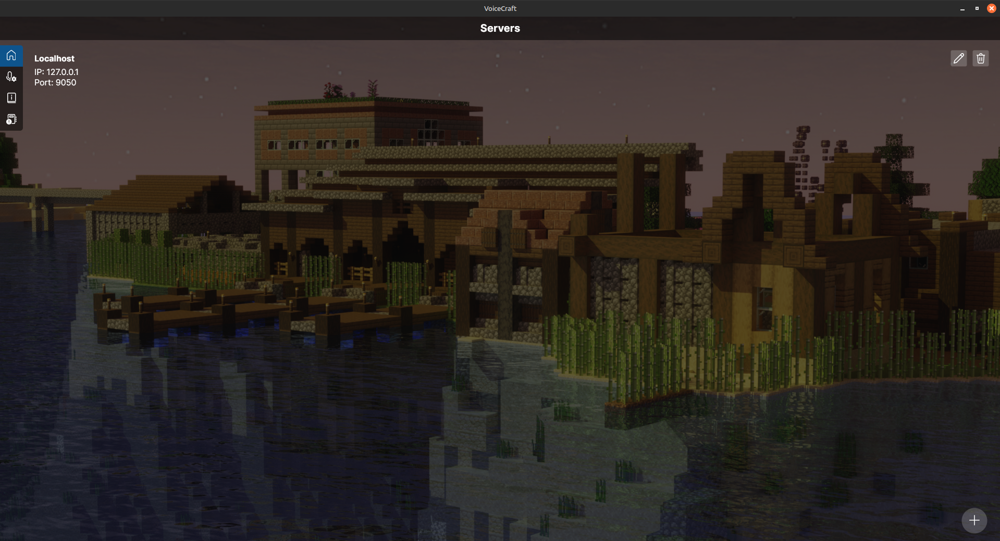

# VoiceCraft Proximity Chat

Welcome to the VoiceCraft documentation!

## Why use VoiceCraft

VoiceCraft is a customizable cross-platform proximity chat solution for Minecraft bedrock edition allowing modifications
of the core functions through the API, allowing streaming of custom audio through addons into VoiceCraft's system and
advanced use of its filters and effects. VoiceCraft's system also is based on linear proximity voice chat for vanilla
bedrock servers as opposed to other alternative proximity chat solutions such as skoice which requires discord and a
java server.

VoiceCraft ALSO **DOES NOT** REQUIRE YOU TO SIGN IN WITH YOUR MINECRAFT ACCOUNT, however it requires that you either use
a custom linking method provided by a custom addon or by the `VoiceCraft.Addon.Basic` addon.

# [Desktop](#tab/desktop)

{width=800}
{width=800}

# [Mobile](#tab/mobile)

{width=400}

---

## Features

- Cross platform support for Android, Windows, Linux, MacOS (soon) and iOS (soon) devices!
- Proximity voice chat with filters and effects!
- Multilingual support.
- Multiple themes.
- Addon API for customization.
- In-app local server hosting.
- Dedicated server software.

## Quick Start

- [Client Installation](./guides/introduction.md?tabs=clientInstallation)
- [Server Installation](./guides/introduction.md?tabs=serverInstallation)
- Addon API Reference

## Dedicated Hosting

- Atrioxhosting €0.44/m (free trial): https://atrioxhost.com/voicecraft

## Support

